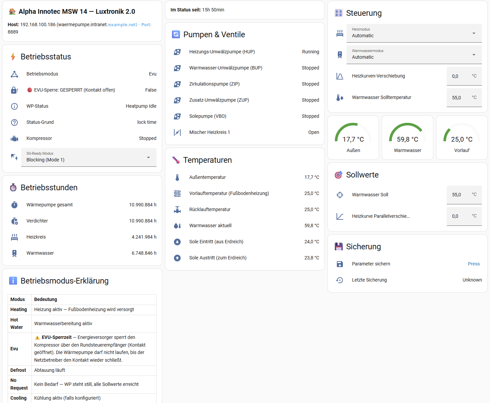

> ## ⚠️ Experimental — Not Actively Maintained
>
> This repository is the **legacy Modbus TCP proxy** byproduct of the Luxtronik 2.0 integration project. It is **no longer actively maintained** and is archived on GitHub (read-only).
>
> **→ Use [luxtronik2-hass](https://github.com/notDIRK/luxtronik2-hass) instead** — the actively maintained Home Assistant HACS integration is the supported path for Luxtronik 2.0 heat pumps.
>
> The proxy remains available for niche use cases (raw Modbus access from non-HA tools like evcc standalone), but receives no updates, bug fixes, or support.

<!--
Keywords: home assistant, hacs, luxtronik, luxtronik 2, alpha innotec, novelan, buderus,
nibe, roth, elco, wolf, heat pump, waermepumpe, wärmepumpe, modbus, modbus tcp, evcc,
sg-ready, sg ready, heat pump integration, ha custom component, ha custom integration,
sole wasser, wasser wasser, luft wasser, heizungssteuerung, bms, energy management,
pv-überschuss, photovoltaik, smart home
-->


# Luxtronik 2 Modbus Proxy + Home Assistant Integration

> Auf Deutsch lesen: [README.de.md](README.de.md)

**Two ways to use this project — pick what you need:**

1. **Home Assistant HACS Integration** (recommended for most users) — installs in 2 minutes via HACS, enter IP, done. Shows sensors, controls heating/hot water/SG-ready, backs up parameters. **No Modbus proxy needed.**
2. **Standalone Modbus TCP Proxy** — for evcc, Grafana, or any Modbus-capable tool. Runs as Docker container or systemd service.

Works with **Alpha Innotec, Novelan, Buderus, Nibe, Roth, Elco, and Wolf** heat pumps running Luxtronik 2.0 controllers — thousands of units with no firmware upgrade path.



---

## 🏠 Home Assistant Integration (HACS)

**You do NOT need Modbus, evcc, or anything else.** The HACS integration talks directly to your heat pump and exposes everything as native HA entities.

### What you get out of the box

| Category | Entities |
|----------|----------|
| **Temperatures** | Outside, flow, return, hot water, source in/out (6 sensors) |
| **Status** | Operating mode, EVU lock status, status duration, compressor, pumps |
| **Pumps** | Heating pump (HUP), hot water pump (BUP), circulation pump (ZIP), additional pump (ZUP), brine pump (VBO), mixer HK1 |
| **Operating hours** | Heat pump total, compressor, heating, hot water |
| **Controls** | Heating mode, hot water mode, SG-Ready, hot water setpoint, heating curve offset |
| **Backup** | One-click parameter backup to JSON file |
| **Discoverable** | +1,367 additional parameters activatable via HA entity registry |

All entity names and translations in **English and German** (more languages welcome).

### Install in 2 minutes

1. Open HACS → **Integrations** → **⋮** → **Custom repositories**
2. Add `https://github.com/notDIRK/luxtronik2-modbus-proxy` as type **Integration**
3. Download the integration, restart Home Assistant
4. **Settings → Devices & Services → Add Integration → "Luxtronik 2 Modbus Proxy"**
5. Enter your heat pump's IP address. Done.

### Example Dashboard

A ready-to-use example dashboard YAML is included at [`docs/examples/dashboard-waermepumpe.yaml`](docs/examples/dashboard-waermepumpe.yaml) — copy it into a new dashboard's raw config editor and you'll get the screenshot above.

---

## ⚙️ Standalone Modbus TCP Proxy

If you want to use the heat pump with **evcc**, Grafana, or any other Modbus TCP client without Home Assistant, run the standalone proxy.

### Architecture

```
┌─────────────────────┐         ┌──────────────────────────┐
│  Luxtronik 2.0      │         │  luxtronik2-modbus-proxy │
│  Heat Pump          │ <────>  │                          │ <── evcc
│  Controller         │         │  Modbus TCP Server       │
│  port 8889          │         │  port 502                │ <── Grafana / others
└─────────────────────┘         └──────────────────────────┘
  proprietary protocol             standard Modbus TCP

Connect → Read/Write → Disconnect (coexists with HA integration)
```

### Quick Start

```bash
cp config.example.yaml config.yaml
# Edit config.yaml: set luxtronik_host to your heat pump's IP
docker compose up -d
```

### Proxy Features

- Modbus TCP server supporting FC3, FC4, FC6, FC16
- Connect-and-release polling (coexists with HA BenPru integration and the HACS integration above)
- SG-ready virtual register for evcc heat pump control
- 1,126 Luxtronik parameters selectable by name
- Configurable via YAML with environment variable overrides
- Docker and systemd deployment
- Write rate limiting to protect the controller NAND flash

---

## 📚 Documentation

- [Developer Quick Start](docs/en/quickstart.md) — build and run from source
- [User Guide](docs/en/user-guide.md) — install and configure (Docker)
- [systemd Service](docs/en/systemd.md) — Linux service deployment
- [evcc Integration](docs/en/evcc-integration.md) — heat pump control via evcc
- [HA Coexistence](docs/en/ha-coexistence.md) — running alongside Home Assistant

## 🤝 Compatibility

| Heat Pump Brand | Luxtronik 2.0 Controller | Notes |
|-----------------|---------------------------|-------|
| Alpha Innotec | ✅ Yes | Tested with MSW 14 (brine/water) |
| Novelan | ✅ Yes | Same controller family |
| Buderus | ✅ Yes | Older Luxtronik-based models |
| Nibe | ✅ Yes | Luxtronik-based models only |
| Roth, Elco, Wolf | ✅ Yes | Same controller platform |

All require Luxtronik 2.0 controller firmware on port 8889.

## 🔐 Security

This is a **public repository**. A pre-commit hook scans every commit for sensitive patterns (real IPs, hostnames, tokens) and blocks the commit if any are found. Contributions welcome — please do the same.

## License

MIT. See [LICENSE](LICENSE).
